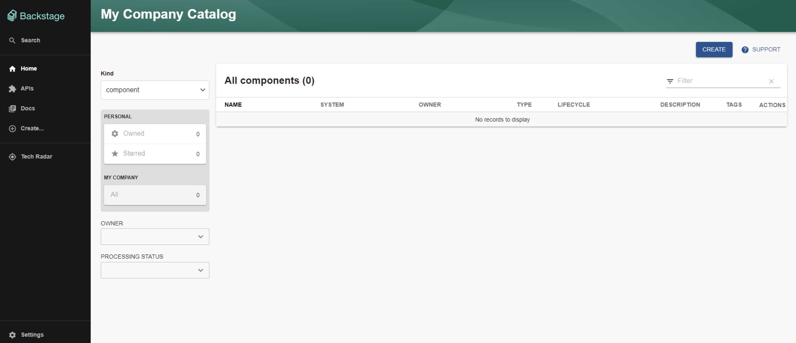

# Documentação de Configuração e Execução do Backstage

## Preparação do Ambiente

### Instalação do Backstage

1. **Criação do aplicativo Backstage:**
   Utilize o comando abaixo para instalar o Backstage:
   ```bash
   npx @backstage/create-app@latest --skip-install
   ```
   Escolha um nome para a sua aplicação quando solicitado.

2. **Instalação das Dependências:**
   Navegue até a pasta da aplicação criada e execute:
   ```bash
   yarn install
   ```

## Compilação do Backstage

1. **Preparação do Build:**
   Execute os comandos abaixo para preparar o ambiente:
   ```bash
   yarn install --frozen-lockfile
   yarn tsc
   yarn build:backend
   ```

## Configuração do Docker

1. **Ajuste no Dockerfile:**
   Abra o projeto no editor de código de sua preferência, como o VSCode.
   Localize o Dockerfile do backend em `packages/backend/Dockerfile` e substitua o conteúdo pelo seguinte:

   ```Dockerfile
   # Instale dependências necessárias para o plugin-scaffolder-backend
   RUN --mount=type=cache,target=/var/cache/apt,sharing=locked        --mount=type=cache,target=/var/lib/apt,sharing=locked        apt-get update &&        apt-get install -y --no-install-recommends python3 g++ build-essential &&        yarn config set python /usr/bin/python3

   # Instale dependências do sqlite3, se necessário
   RUN --mount=type=cache,target=/var/cache/apt,sharing=locked        --mount=type=cache,target=/var/lib/apt,sharing=locked        apt-get update &&        apt-get install -y --no-install-recommends libsqlite3-dev

   # Utilize o usuário menos privilegiado 'node'
   USER node
   WORKDIR /app
   ENV NODE_ENV development
   COPY --chown=node:node yarn.lock package.json packages/backend/dist/skeleton.tar.gz ./
   RUN tar xzf skeleton.tar.gz && rm skeleton.tar.gz
   RUN --mount=type=cache,target=/home/node/.cache/yarn,sharing=locked,uid=1000,gid=1000        yarn install --frozen-lockfile --production --network-timeout 300000
   COPY --chown=node:node packages/backend/dist/bundle.tar.gz app-config*.yaml ./
   RUN tar xzf bundle.tar.gz and rm bundle.tar.gz

   CMD ["node", "packages/backend", "--config", "app-config.yaml"]
   ```

## Execução via Docker

1. **Construção da Imagem Docker:**
   Construa a imagem utilizando o comando:
   ```bash
   docker image build . -f packages/backend/Dockerfile --tag backstage --no-cache
   ```

2. **Execução do Container:**
   Inicie o container com:
   ```bash
   docker run -it -p 7007:7007 backstage
   ```

3. **Acesso ao Backstage:**
   Após os passos acima, o Backstage estará acessível através do link [http://localhost:7007](http://localhost:7007).

## Evidências de Execução

As evidências de execução estão disponíveis abaixo:



